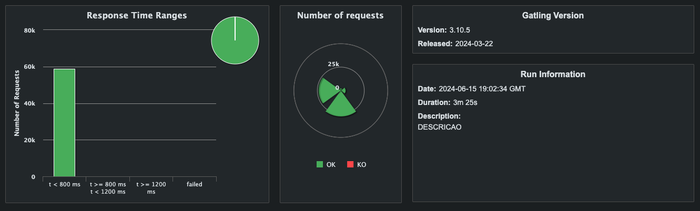
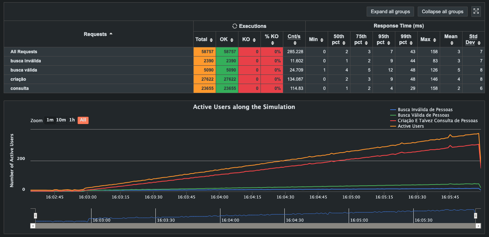
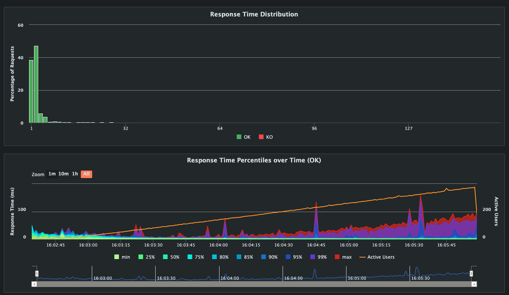
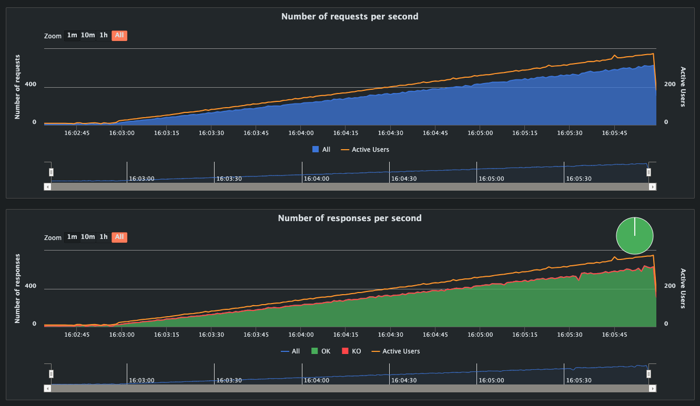

# Backend Fight 2023 using FastApi

[](https://www.python.org)
[](https://github.com/psf/black)
[](https://github.com/noverde/backend-fight-2023/actions)
[](LICENSE)

## Table of Contents

- [Introduction](#introduction)
- [Features](#features)
- [Installation](#installation)
- [Gatling installation](#gatling-installation)
- [Usage](#usage)
  - [Starting services](starting-services)
    - [Network mode host](network-mode-host)
- [My personal best result](#my-personal-best-result)

## Introduction

This project was created to improve my knowledge of FastAPI. The inspiration came from the [Rinha de Backend 2023](https://github.com/zanfranceschi/rinha-de-backend-2023-q3) project, which challenged participants to build a simple API following specific guidelines. The API needed to withstand a 5-minute load test with a minimal number of knockouts (KO's) and operate within limited resources (1.5 CPUs and 3 GB memory).

## Features

- **FastAPI Integration**: Leveraging the powerful FastAPI framework for building APIs.
- **Load Testing**: Designed to withstand a 5-minute load test with minimal KO's (knockouts).
- **Performance Optimization**: Optimized for high performance and low latency.
- **Dependency Injection**: Utilizes FastAPI's dependency injection system for better modularity and testing.
- **Automated Testing**: Includes unit tests to ensure code quality.
- **Deployment Ready**: Configured for easy deployment using Docker.


## Installation

Follow these steps to get the project up and running:

```shell
# Clone the repository
git clone git@github.com:rodrigosantiag/backend-fight-2023.git

# Navigate to the project directory
cd backend-fight-2023

# Install dependencies
make install-dev

# Run the project on network mode host
make up

# Run the project on network mode bridge
make up-bridge

# Run unit tests
make test

# Run logs
make logs
```

## Gatling installation

```shell
# Navigate to the gatling directory
cd teste/gatling

# Run the script installation
./install-gatling
```

## Usage

This project runs a Docker Compose file with four services: one PostgreSQL database, two FastAPI APIs, and an Nginx load balancer. All these resources must share a total of 1.5 CPUs and 3 GB of memory.

### Starting services

#### Network mode host

```shell
make nginx
```

Note: In network mode `host`, update the `DATABASE_URL` environment variable in the `.env` file to connect to the database host `localhost` instead of `database` (the default value for bridge mode as provided in the `.env_sample` file).

#### Network mode host

```shell
make nginx-bridge
```

With all services up and running, navigate to gatling directory and run the stress test script

```shell
cd teste/gatling

./run-test
```

The stress test takes 5 minutes. At the end of the test, a report will be provided in the terminal.

## Personal best result

Here are the results from my best stress test:









## License

This project is licensed under the MIT License. See the [LICENSE](https://www.mit.edu/~amini/LICENSE.md) file for details.

## Acknowledgments

* [FastAPI](https://fastapi.tiangolo.com/)
* [Docker](https://www.docker.com/)
* [Gatling](https://gatling.io/)
* [Rinha de Backend 2023](https://github.com/zanfranceschi/rinha-de-backend-2023-q3)
